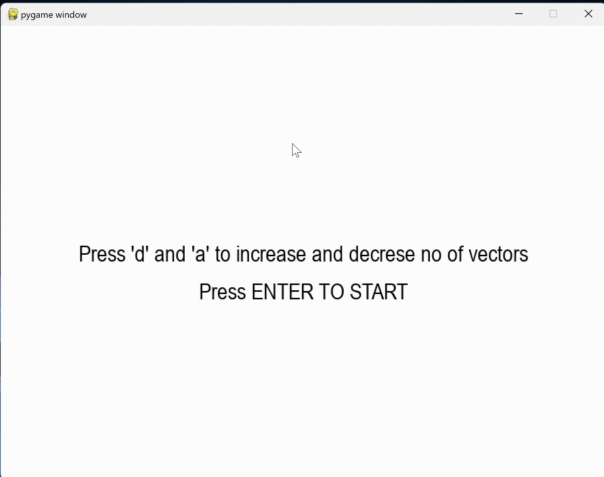

# Fourier Transform Project

## Overview

This project, undertaken in 2022, delves into the fascinating world of Fourier Transforms. The primary objective is to utilize Fourier Transforms to render SVG images through the rotation of circles, expressed as a sum of sine waves. The implementation is bifurcated, with code developed in both Python using Pygame and JavaScript using p5.js. This dual-language approach serves as a challenge to deepen comprehension in distinct programming paradigms.

## Fourier Transform Theory

### Basics

The Fourier Transform is a mathematical tool that transforms a function of time (or space) into a representation in the frequency domain. For a periodic function, the Fourier Series expansion can be expressed as:

%20=%20a_0%20+%20%5Csum_%7Bn=1%7D%5E%7B%5Cinfty%7D%20%5Cleft(a_n%20%5Ccos(2%5Cpi%20nft)%20+%20b_n%20%5Csin(2%5Cpi%20nft)%5Cright))

where \(f(t)\) is the function, \(a_0\), \(a_n\), and \(b_n\) are coefficients, \(n\) is the harmonic number, \(f\) is the frequency, and \(t\) is time.

### Fourier Transform

For a non-periodic function, the Fourier Transform is defined as:

%20=%20%5Cint_%7B-%5Cinfty%7D%5E%7B%5Cinfty%7D%20f(t)%20%5Ccdot%20e%5E%7B-i%5Comega%20t%7D%20dt)

where \(F(\omega)\) is the Fourier Transform, \(f(t)\) is the function in the time domain, \(\omega\) is the angular frequency, and \(i\) is the imaginary unit.

## Implementation

The project involves creating a visual representation of an SVG image using rotating circles, each corresponding to a specific frequency component obtained through Fourier Transforms.

### Technologies Used

- **Python:** Pygame library was employed for the Python implementation.
- **JavaScript:** The p5.js library facilitated the JavaScript version.

### How to Run

#### Python (Pygame)

1. Ensure you have Python installed on your system.
2. Install the Pygame library using `pip install pygame`.
3. Run the Python script: `python main.py`.

#### JavaScript (p5.js)

1. Open the HTML file in a web browser.
2. Ensure an active internet connection for the p5.js library to load.

### Screenshots

## Learnings

- **Fourier Transforms:** Deepened understanding of Fourier Transforms and their application in signal processing and image representation.
- **Pygame and p5.js:** Gained proficiency in using these libraries for graphics and animation in Python and JavaScript, respectively.
- **Dual-language Implementation:** Successfully implemented the same concept in both Python and JavaScript, demonstrating flexibility and adaptability in different programming environments.

Feel free to explore the code and experiment with different SVG images to witness the mesmerizing visualizations created by the Fourier Transform magic!
